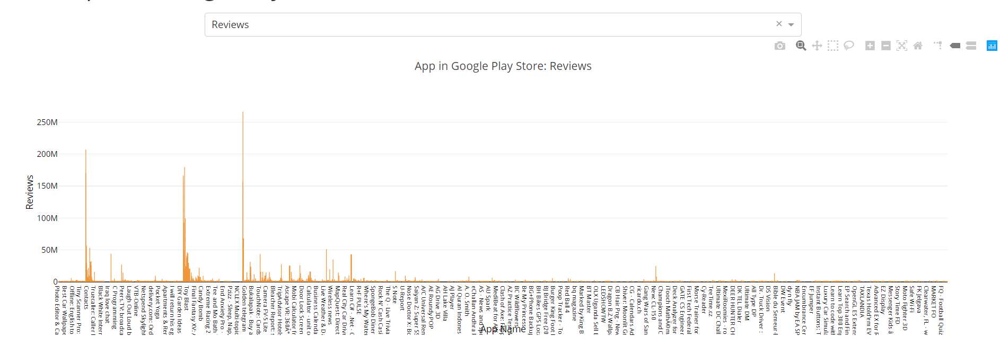

# Lab 3: Data Visualization

Author:王星洲

StudentID:1652977

brief: This file is a user's manual explaining how to run the program.

------

Before opening the program, please make sure:

- You have python3 environment
- You know how to use pip to install support if you don’t have one
- You know how to run python files

------

Steps:(If you lack any module, please install it by pip)

Please make sure you haven’t changed the file path.

then:

1. run `lab3_Data Visualization.py` to train.
2. go to http://127.0.0.1:8050 to check the page.

## Bar Graph

You can use the dropdown component to change the attribute you want to see.

## Scatter Graph

You can see the relationship between Rating and Reviews.

## Pie Graph

You can use the dropdown component to change the attribute you want to see.

---

### Hope you have fun!

